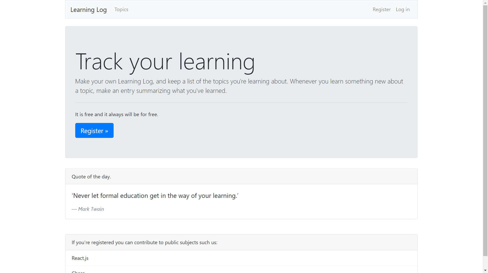

# Learning Log

Learning Log is a Djang Web-App that allows users to
log the topics they're interested in and make journal entries as
they learn about each topic.

# Live Version

To see an online version go to:

[Learning Log 2021](https://learning-log-2021.herokuapp.com/)

## Usage

The user can create account and store the subjects and add entries. The user can choose if the topic is publicly visible or not.

### Instalation

1. Create virtual env.
2. pip install requirements.txt
3. Remeber to set up a secret key.
4. Migrate the database.
5. Run: python manage.py runserver
6. Go to local host.

### Contributing
Pull requests are welcome. For major changes, please open an issue first to discuss what you would like to change.

Please make sure to update tests as appropriate.

## License
[MIT](https://choosealicense.com/licenses/mit/)